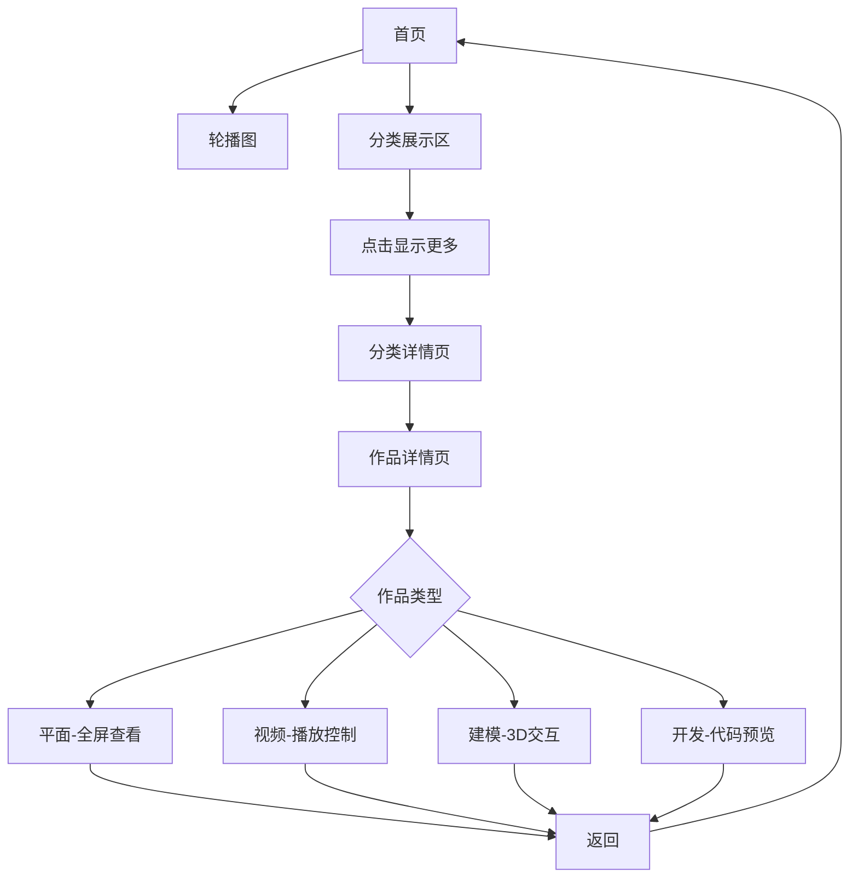

# 个人高端商务作品集网站 - 产品需求文档

## 1. 产品概述

一个面向个人的高端商务黑暗风格作品集网站，用于展示平面设计、视频、3D建模和开发项目。网站支持完整的响应式设计，配备上传管理、搜索和明暗模式切换功能，为用户提供专业级的作品展示体验。

- 解决个人作品分散管理的问题，提供统一的展示平台
- 目标用户：自由职业者、创意工作者、开发者展示个人作品集

---

## 2. 核心功能

### 2.1 用户角色

| 角色 | 权限 | 说明 |
|------|------|------|
| 访客 | 浏览 | 查看所有公开作品 |
| 管理员 | 上传/删除/编辑 | 完整管理功能 |

### 2.2 功能模块

1. **首页**：轮播大图 + 四大分类展示区
2. **分类详情页**：各分类作品网格展示
3. **作品详情页**：分类专属交互功能
4. **上传系统**：拖拽上传 + 自动分类
5. **搜索系统**：快速搜索 + 明暗模式切换
6. **作品管理**：长按操作（下载/删除）

### 2.3 页面详情

| 页面名称 | 模块名称 | 功能描述 |
|----------|----------|----------|
| 首页 | 轮播图区域 | 顶部全宽轮播，展示四分类各1张代表作品，支持自动轮播和手动切换 |
| 首页 | 分类展示区 | 四个分类依次展示，每个区域显示5个缩略图 + "显示更多"按钮 |
| 分类详情页 | 作品网格 | 瀑布流/网格布局展示该分类所有作品，支持加载更多 |
| 作品详情页 | 平面类 | 点击图片全屏放大查看，支持缩放拖动 |
| 作品详情页 | 视频类 | 标准播放器，进度条/音量/倍速/全屏控制 |
| 作品详情页 | 建模类 | 3D模型交互（移动端触屏/桌面端鼠标/平板双指），XYZ坐标系参考线 |
| 作品详情页 | 开发类 | 左右分栏：左侧代码区（语法高亮/可编辑切换），右侧实时预览 |
| 导航栏 | 搜索展开 | 点击搜索图标展开输入框，确认后收起并显示结果 |
| 导航栏 | 模式切换 | 明暗模式快速切换按钮 |
| 导航栏 | 上传入口 | 点击打开上传面板 |
| 上传面板 | 拖拽上传 | 支持拖拽或点击选择，自动根据后缀匹配分类 |
| 作品卡片 | 长按操作 | 长按弹出下载/删除按钮 |

---

## 3. 核心流程

### 3.1 用户浏览流程

```
用户访问首页 → 查看轮播图 → 浏览分类展示 → 点击进入分类详情 → 查看作品详情 → 返回继续浏览
```

### 3.2 作品管理流程

```
点击上传入口 → 拖拽或选择文件 → 系统自动识别分类 → 上传完成 → 显示在对应分类
```

### 3.3 流程图



---

## 4. 用户界面设计

### 4.1 设计风格

- **主题**：高端商务黑暗风格
- **配色**：
  - 主背景：#0a0a0f（深黑）
  - 卡片背景：#14141f（深灰紫）
  - 强调色：#6366f1（靛蓝紫）
  - 次要强调：#8b5cf6（紫罗兰）
  - 文字主色：#f8fafc（近白）
  - 文字次要：#94a3b8（灰蓝）
- **圆角**：8px-16px
- **阴影**：柔和发光效果，靛蓝色光晕
- **字体**：
  - 标题：Playfair Display 或类似衬线字体
  - 正文：Inter 或类似无衬线字体

### 4.2 页面设计概述

| 页面名称 | 模块名称 | UI元素描述 |
|----------|----------|------------|
| 首页 | 导航栏 | 固定顶部，毛玻璃效果背景，深色半透明，搜索图标 + 模式切换 + 上传按钮 |
| 首页 | 轮播图 | 全宽，高度60vh，渐变遮罩，底部指示器，悬浮时暂停 |
| 首页 | 分类区块 | 大标题 + 副标题，5个缩略图网格，"显示更多"按钮 |
| 分类详情 | 作品网格 | 响应式网格，悬停放大效果，加载动画 |
| 详情页-平面 | 图片查看器 | 全屏遮罩，支持缩放拖动，关闭按钮 |
| 详情页-视频 | 播放器 | 自定义深色主题播放器控件，悬浮显示 |
| 详情页-建模 | 3D查看器 | 半透明XYZ轴参考线，交互旋转提示 |
| 详情页-开发 | 代码预览 | 分栏布局，代码区带行号，实时预览区 |

### 4.3 响应式设计

- **桌面端（>1024px）**：完整布局，多列网格，鼠标交互
- **平板端（768-1024px）**：双列网格，双指触控，悬停效果
- **移动端（<768px）**：单列网格，触屏手势，全屏体验优化

### 4.4 动效设计

- 页面加载：交错淡入动画，stagger 100ms
- 悬停效果：scale(1.02) + 阴影增强
- 模式切换：平滑过渡 300ms ease
- 轮播切换：淡入淡出 500ms
- 搜索展开：高度动画 + 透明度 200ms

---

## 5. 技术约束

- 使用本地存储（localStorage）模拟数据持久化
- 所有图片/视频使用占位符或外部资源
- 3D建模使用Three.js或模型查看器库
- 代码高亮使用Prism.js或Highlight.js
- 移动端长按使用touch事件模拟
