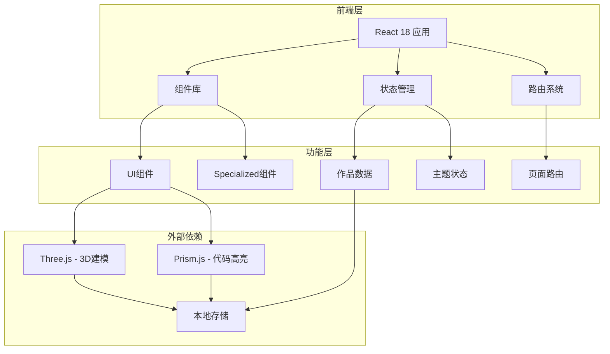
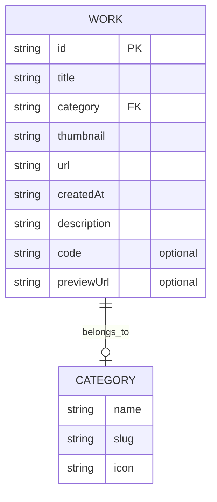

# 个人高端商务作品集网站 - 技术架构文档

## 1. 架构设计



## 2. 技术栈

- **前端框架**：React 18 + Vite
- **样式方案**：Tailwind CSS 3
- **路由管理**：React Router v6
- **3D渲染**：Three.js + @react-three/fiber + @react-three/drei
- **代码高亮**：Prism.js
- **状态管理**：React Context + useReducer
- **数据持久化**：localStorage
- **图标库**：Lucide React

## 3. 路由定义

| 路由 | 用途 | 组件 |
|------|------|------|
| / | 首页 | HomePage |
| /category/:type | 分类详情 | CategoryPage |
| /work/:type/:id | 作品详情 | WorkDetailPage |

## 4. 组件结构

```
src/
├── components/
│   ├── layout/
│   │   ├── Navbar.jsx          # 导航栏（搜索/模式切换/上传）
│   │   └── Footer.jsx         # 页脚
│   ├── home/
│   │   ├── HeroCarousel.jsx    # 轮播图组件
│   │   └── CategorySection.jsx # 分类展示区块
│   ├── common/
│   │   ├── WorkCard.jsx        # 作品卡片（长按操作）
│   │   ├── UploadModal.jsx     # 上传面板
│   │   ├── SearchOverlay.jsx  # 搜索展开层
│   │   └── ImageViewer.jsx      # 图片全屏查看器
│   └── details/
│       ├── VideoPlayer.jsx     # 视频播放器
│       ├── ModelViewer.jsx     # 3D模型查看器
│       └── CodePreview.jsx     # 代码预览组件
├── pages/
│   ├── HomePage.jsx
│   ├── CategoryPage.jsx
│   └── WorkDetailPage.jsx
├── context/
│   ├── ThemeContext.jsx        # 明暗模式上下文
│   └── WorksContext.jsx       # 作品数据上下文
├── hooks/
│   ├── useLongPress.js         # 长按手势Hook
│   └── useLocalStorage.js      # 本地存储Hook
├── data/
│   └── mockWorks.js           # 模拟作品数据
└── utils/
    └── fileHelpers.js          # 文件分类辅助函数
```

## 5. 数据模型

### 5.1 作品数据结构

```typescript
interface Work {
  id: string;
  title: string;
  category: 'graphic' | 'video' | 'model' | 'development';
  thumbnail: string;
  url: string;
  createdAt: string;
  description?: string;
  // 开发类专用
  code?: string;
  previewUrl?: string;
}
```

### 5.2 ER图



## 6. 文件类型映射

| 分类 | 接受的文件后缀 |
|------|----------------|
| graphic | .jpg, .jpeg, .png, .gif, .webp, .svg, .psd, .ai |
| video | .mp4, .webm, .mov, .avi |
| model | .obj, .fbx, .gltf, .glb, .stl |
| development | .html, .css, .js, .jsx, .ts, .tsx |

## 7. 响应式断点

| 设备 | 断点 | 布局 |
|------|------|------|
| 桌面 | >1024px | 4-5列网格，hover效果 |
| 平板 | 768-1024px | 2-3列网格，双指交互 |
| 移动 | <768px | 单列，全屏手势 |

## 8. 性能优化

- 图片懒加载（Intersection Observer）
- 组件按需加载（React.lazy）
- 3D模型压缩（GLTF格式优先）
- CSS动画优先（GPU加速）
